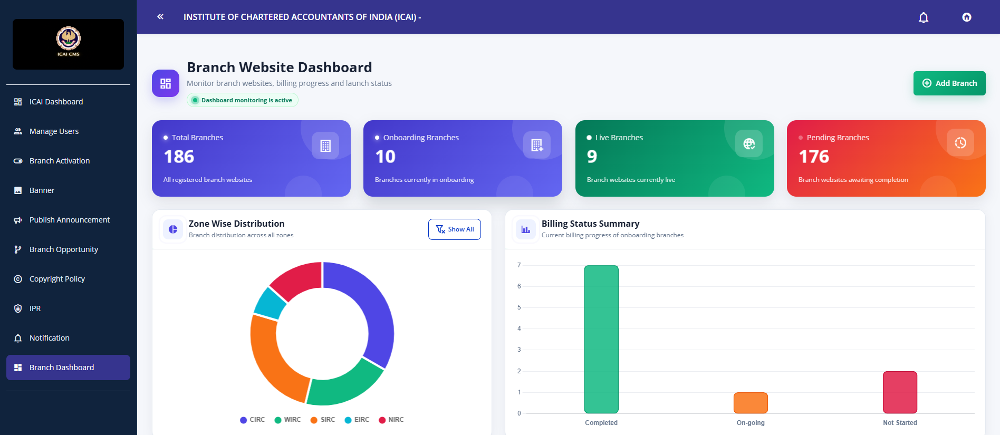
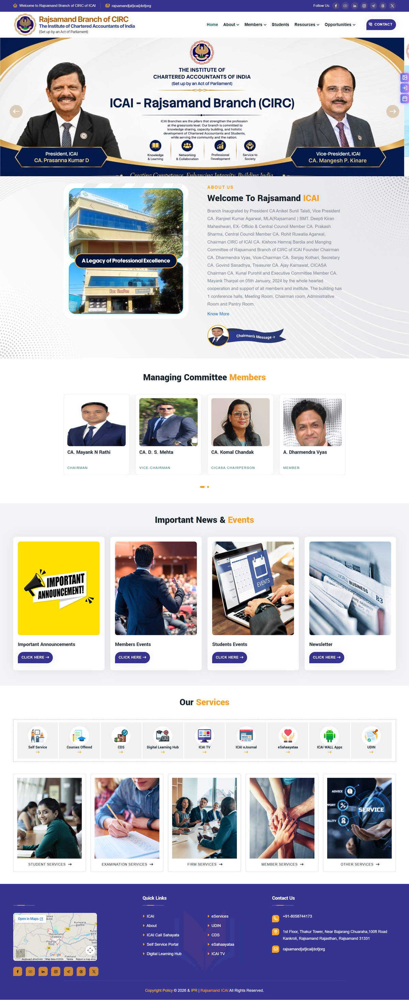
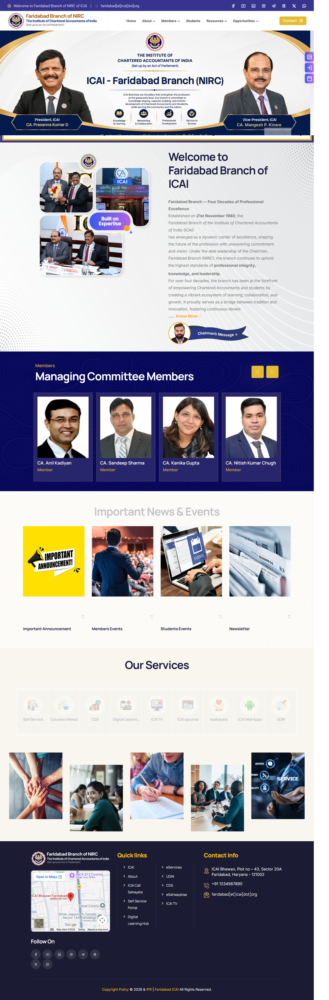
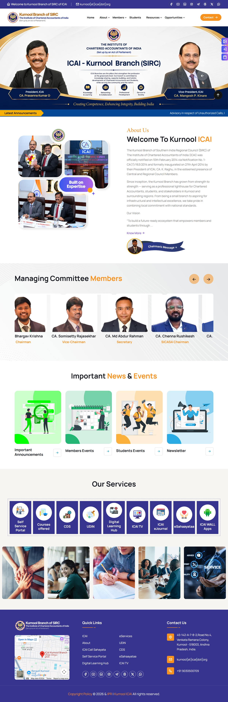
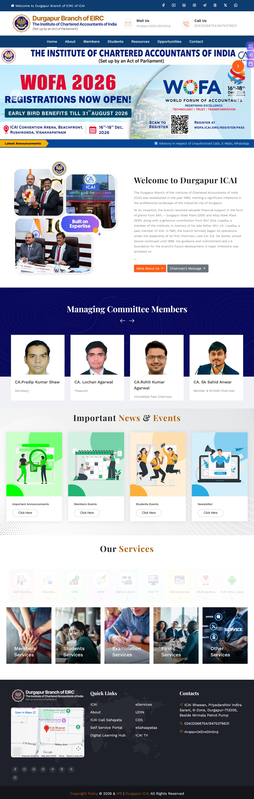
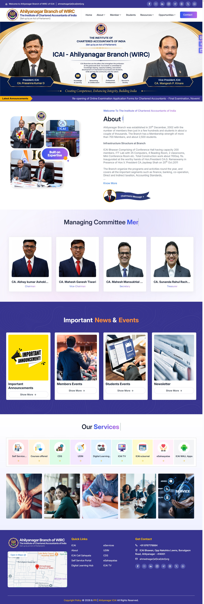

<!-- ===================== HEADER ===================== -->

  

  

---

# 👋 About Mee

- 🎓 MCA Gold Medalist.
- 💼 ASP.NET Backend Developer
- 🌱 Learning Microservices, Azure & Docker
- ⚛️ Exploring React Ecosystem
- 💬 Ask me about **C#, ASP.NET Core, Java, SQL, Postgresql**
- 📫 Reach me at **abhinashpanigrahi9@gmail.com**
- 🏋️ Gym Enthusiast& Powerlifter & Lifelong Learner

 

---

# 🚀 Current Focus

- ✔ ASP.NET Core MVC
- ✔ ASP.NET Core Web API
- ✔ Entity Framework Core
- ✔ SQL Server
- ✔ React
- ✔ Microservices
- ✔ Docker
- ✔ Azure

---

# 💻 Tech Stack

## Languages

  

## Backend

  

## Frontend

  

## Database

  

## Tools

  

---

| Project | Tech Stack |
|---|---|
| 🏛️ **ICAI Multi-Branch Website & CMS Platform** | ASP.NET Core MVC, C#, EF Core, SQL Server, jQuery, AJAX |
| 📅 **Schedule Management System** | ASP.NET Core MVC, C#, EF Core, SQL Server, jQuery, AJAX, Bootstrap |
| 🧑‍💼 **Employee Grievance Management System** | ASP.NET Core MVC, SQL Server |
| 🎓 **University Management System** | ASP.NET Core |
| ☕ **Spring Boot Web Scraper** | Java, Spring Boot |

---
# 💼 Professional Project Showcase

## 🏛️ ICAI Multi-Branch Website & CMS Platform

A dynamic multi-branch web platform developed for **The Institute of Chartered Accountants of India (ICAI)**, designed to manage and deliver branch-specific content across multiple regional councils and branches through a centralized Content Management System.

### 🛠️ Tech Stack

  
  
  
  
  
  
  
  

### 🖥️ Centralized CMS Dashboard

  

The centralized CMS provides branch-level administration, content management, branch monitoring and dynamic website configuration from a unified dashboard.

### 🌐 Regional Branch Websites

<table>
<tr>
<td width="50%" align="center" valign="top">
<strong>🏢 CIRC</strong>
  

</td>

<td width="50%" align="center" valign="top">
<strong>🏢 NIRC</strong>
  

</td>
</tr>

<tr>
<td width="50%" align="center" valign="top">
<strong>🏢 SIRC</strong>
  

</td>

<td width="50%" align="center" valign="top">
<strong>🏢 EIRC</strong>
  

</td>
</tr>
</table>

  <strong>🏢 WIRC</strong>

  

### ⚙️ Key Contributions

- Developed and maintained dynamic **ASP.NET Core MVC** branch websites.
- Worked on a centralized **CMS** for managing multiple ICAI branch websites.
- Implemented branch-specific content management and dynamic data rendering.
- Developed modules for **Announcements, Events, Opportunities, Background Materials** and other branch content.
- Implemented branch-based filtering and content management.
- Developed dynamic dashboard components and data visualizations.
- Integrated **SQL Server** with **Entity Framework Core** for data management.
- Used **JavaScript, jQuery and AJAX** for asynchronous operations and interactive functionality.
- Worked with reusable layouts and components to support multiple regional and branch websites.

---

# 🏆 Achievements

🥇 MCA Gold Medalist

🏅 IBM SkillsBuild Certified

💻 Passionate Full Stack Developer

🚀 Always Learning New Technologies

---

# 📜 Certifications

✔ IBM SkillsBuild

✔ IBM Front-End Web Development Internship

✔ Prompt Engineering

---

# 📈 Contribution Graph

  

---

# 📊 Profile Summary

  

---

# 💬 Random Dev Quote

  

---

<h2 align="center">🌐 Connect With Me</h2>

  

  

  

  

---

# 👀 Visitors

  

---

# 💡 Developer Philosophy

> **"First solve the problem, then write the code."**

---

  

